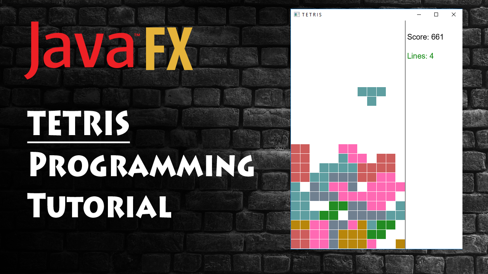

# Tetris
Tetris Game in JavaFX)) (for mid)

#Controls:

left arrow: move shape to the left
right arrow: move shape to the right
up arrow: rotate the shape
down arrow: make shape drop faster
spacebar: drop the shape all the way

#TODO:

fix: removing rows and incrementing points is throwing thread-related exceptions
add game ending conditions (reaching top of the grid,...)
add preview of the next shape
add spacebar action

#Purpose

This is the final project for OOP course.
By writing this project student learn classes.

For entertainment :) enjoy your game.
Good luck!

